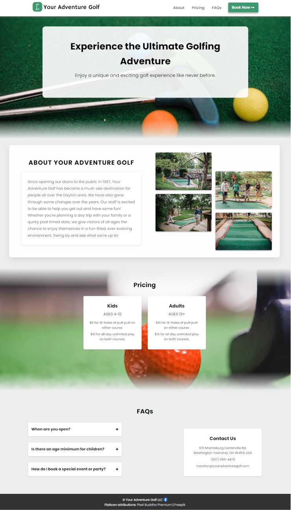
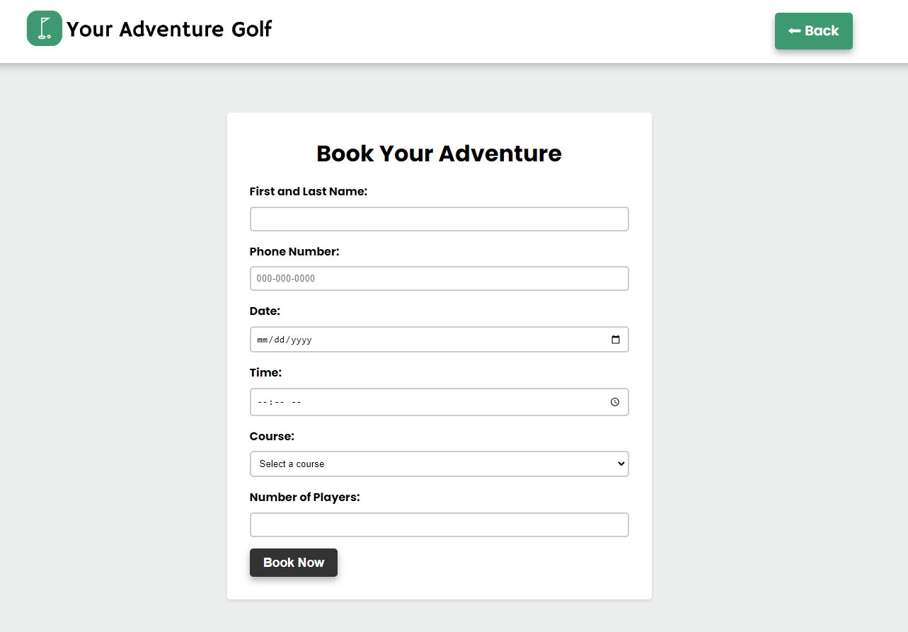
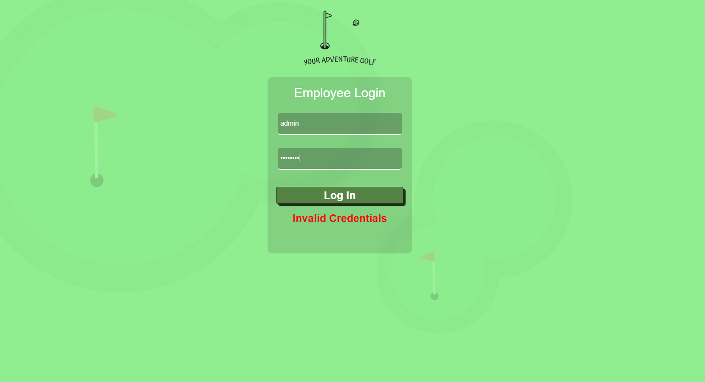
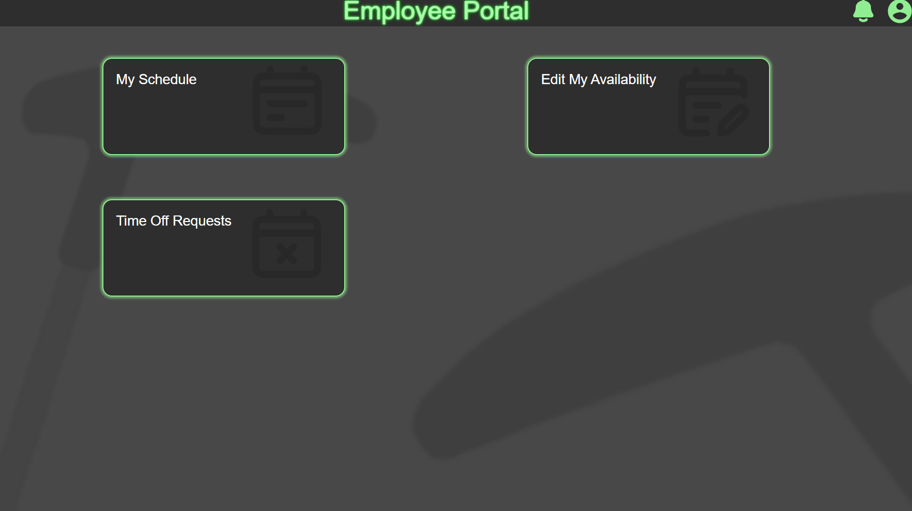
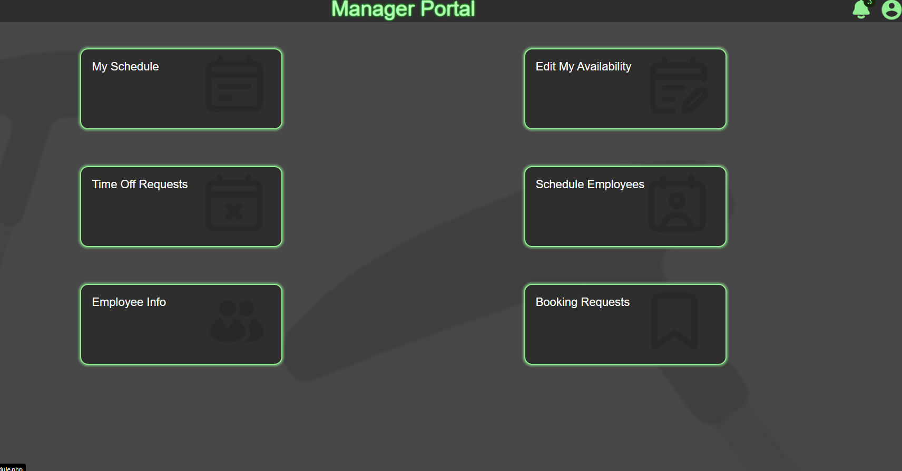
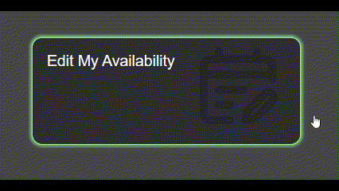
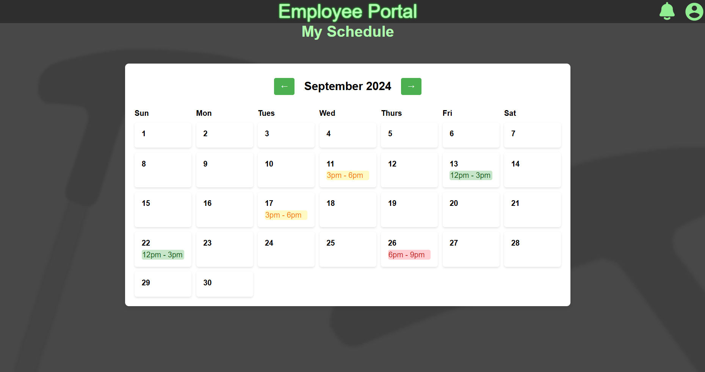

# GolfSite

GolfSite is a website developed for a local mini-golf business, **My Adventure Golf**, to streamline operations and enhance the user experience. 
The platform allows for management of employee schedules, time-off requests, and user authentication with varying permission levels for employees, managers,
and administrators. This project was developed by a team of four, Caden Conde, John Jones, Xander Combs, and Eric Bucher.

## Features

- **Full Database System**: Built using MySQL, the site manages all business-related data efficiently, including users, schedules, and requests.
- **Authentication System**: Coded in PHP and SQL, the system allows secure login for both employees and managers, each with different levels of access.
- **Role-Based Access Control**: 
  - *Employees*: Can view schedules, request time off, and manage their availability.
  - *Managers*: Can approve or deny time-off requests, modify schedules, and manage employee data.
  - *Admins*: Have full control over the system, including database management and user permissions.
- **Scheduling System**: Includes features such as:
  - Employee availability tracking
  - Editable availability
  - Time-off request submission and approval workflow
- **Frontend Design**: The site was designed using HTML, CSS, and JavaScript, providing a clean, user-friendly interface.

## Tech Stack

- **Frontend**: 
  - HTML5
  - CSS3
  - JavaScript
- **Backend**: 
  - PHP
  - MySQL (for the database)
- **Database**: MySQL

- **Version Control**: GitHub

## Screenshots

Here are some previews of the website:

### Frontend:

Index:

Booking Page:

### Backend:

Login:

Employee View:

Admin View:

Animations:

Scheduling:

## The Team
### Caden
- Lead Backend/Database Devloper
- Assisted with Admin Pages / Database Connectivity
### John
- Lead Frontend/CSS Developer
- Managed Accessibility and Site Preformance
### Xander
- Created/Designed Calendar and Scheduling System
- Assisted with Frontend Devepment and Documentation
### Eric
- Lead Admin Page Developer
- Managed Client Communication
